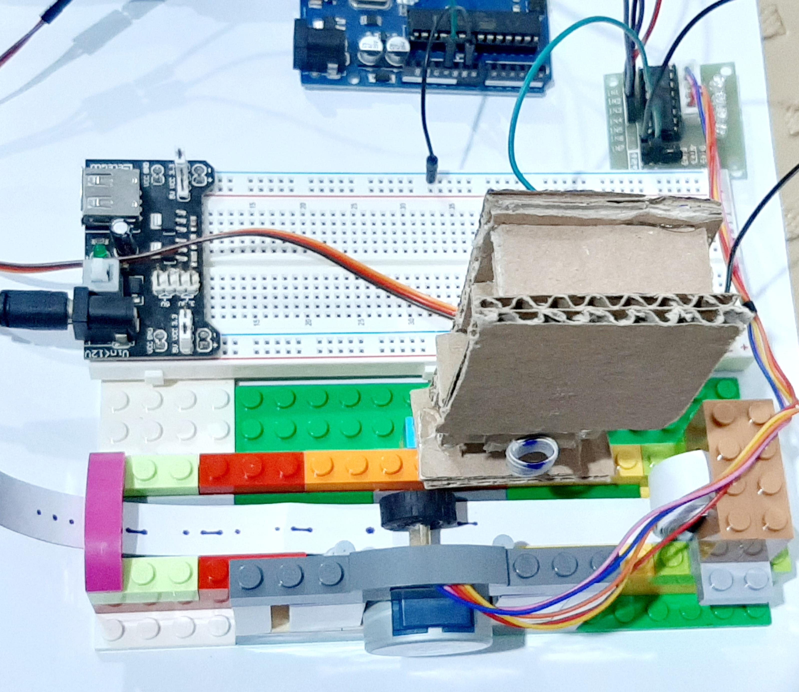

# Morse Code Robot Project

This project involves building a robot that converts text into Morse code and writes it down. The robot is constructed using cardboard, Lego, and Arduino components. The repository includes the code necessary to run the robot.

## Getting Started

To get started with this project, you'll need to:

1. Follow the detailed instructions provided on the project page to assemble the robot and set up the Arduino components.
2. Upload the provided code to your Arduino board.

## Detailed Instructions

For detailed assembly instructions and a step-by-step guide, please visit the project page [here](https://www.instructables.com/Arduino-Morse-Code-Writer/).

## License

This project is licensed under the MIT License - see the [LICENSE](LICENSE) file for details.

Feel free to modify this as needed! If you have any specific details you'd like to add or change, let me know.